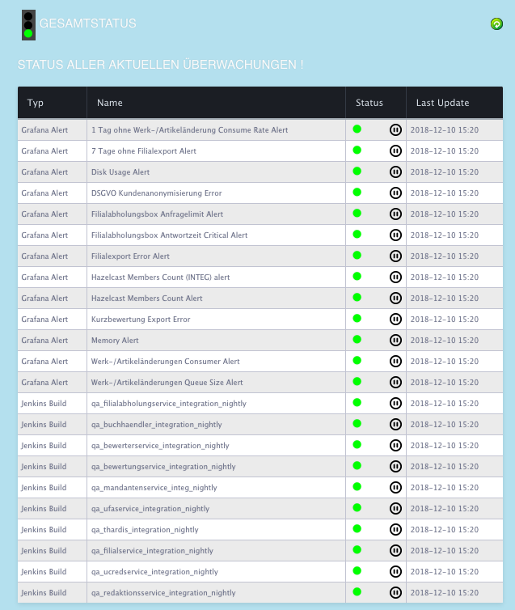
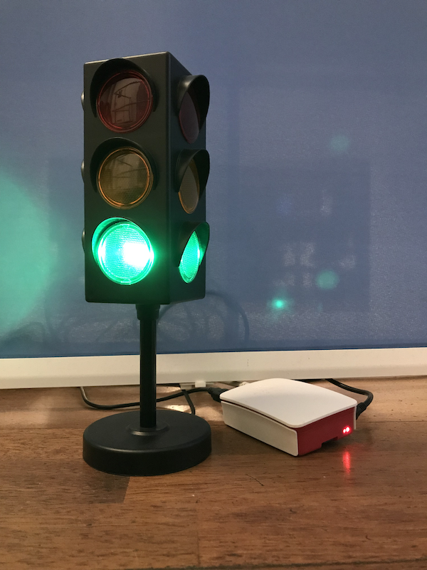

# StatusAmpel

Dieses Project stellt einen Node.js Server bereit der verschiedene Dienste abfragt und einen Gesamtstatus ermittelt. 



Der Status wird auf einer USB Ampel visualisiert.



## Features

* Anbindung beliebiger Monitoring und Alarming Dienste
    * Grafana Alerts Anbindung per Polling
    * Jenkins Jobs Anbindung per Polling
    * DTSMon Anbindung per WebCrawling
    * Azure Pipeline Anbindung ber Polling
* Visulisierung und Alarming über unterschiedliche Reporter möglich
    * WebInterface für einen detailierten Einblick in die Einzelstatus abfragen
    * Alarmmeldungen im Slack Channel
    * Visualisierung über eine USB Ampel
    * Visualisierung über Philips HUE Lampen
    * Alarmmeldung können in einer InfluxDB archiviert & visualisiert werden.
    * Benachrichtigung per Sound
* Benachrichtigung über relevante Ereignisse
    * Status wechsel eines Jira Tickets
    * Abschluss eines Jira Tickets
* Pausieren einzelner Alarme mit automatischer Reaktivierung bei nächstem Status Wechsel
* Serverbetrieb
    * Unterstützt Serverbetrieb inkl. Prozessmanagement & Autostart nach Reboot
    * Voll konfigurierbar per Konfig JSON
    * Unterstütz unterschiedliche Konfiguration auf unterschiedlichen Umgebungen (dev, prod, etc.)
    * Logging & Error Logging 
    
Für geplante Features und Änderungen siehe [CHANGELOG.md](CHANGELOG.md)
     
## Getting Started

Diese Anleitung zeigt anhand einer Beispiel Installation auf dem Raspberry wie die der StatusMonitor installiert, eingerichtet und betrieben werden kann.

### Prerequisites

* Raspberry Pi 3 - Im folgenden Beispiel wird die Einrichtung an Hand eines Raspberry PI 3 mit bereits installiertem Rasbian beschrieben.
* Cleware USB Ampel - Die Ampel kann an einem beliebigen System (Linux, Windows, MacOS) mit installiertem "ClewareControl" angeschlossen sein.
    * Cleware Shop & Software: http://www.cleware.info/data/linux.html
    * Cleware Linux / Rasbian Client: https://github.com/flok99/clewarecontrol/blob/master/README.md
* git
* node.js

#### Raspberry
Basis ist eine Standard Rasbian Stretch Lite installation
* Download Rasbian: https://www.raspberrypi.org/downloads/raspbian/

Nach der Ersteinrichtung folgt die Anpassung:

```
sudo apt-get update
sudo apt-get upgrade
sudo apt-get install vim
sudo apt-get install nano
```

#### Install ClewareControl

Installieren der benötigten Bibliotheken
```
sudo apt-get update
sudo apt-get install libhidapi-dev
sudo apt-get install gettext
```

Installation der Cleware Software
```
git clone https://github.com/flok99/clewarecontrol.git
cd clewarecontrol
sudo make install
sudo cp /bin/clewarecontrol /usr/bin/clewarecontrol
```

Zum Testen muss die Ampel per USB angeschlossen sein. Zuerst muss dann die DeviceId ermittelt werden. Anshcließen kann über die Kommandozeile direkt die Ampel gesteuert werden.
```
sudo clewarecontrol -l
sudo clewarecontrol -d <DEVICEID> -as 2 1
```

#### Installation von git
```
sudo apt-get update
sudo apt-get install git
```

#### Installation von node.js
```
sudo apt-get update
curl -sL https://deb.nodesource.com/setup_12.x | sudo -E bash -
sudo apt-get install -y nodejs
node -v
```

### Installation
#### Installation des StatusAmpel Projekts
```
git clone https://github.com/jenszech/StatusLight.git
cd StatusAmpel
npm install
```

#### Instalation der Audio Unterstützung
```
sudo apt-get install alsa-base alsa-utils
```

#### Einrichten als Hintergrundprocess
Einrichten als Process mit Autostart
```
sudo npm install pm2@latest -g
pm2 start bin/statusLight
pm2 startup systemd
sudo env PATH=$PATH:/usr/bin /usr/lib/node_modules/pm2/bin/pm2 startup systemd -u pi --hp /home/pi
pm2 list
pm2 save
```

#### Einrichten einer Umgebungsvariable
Um unterschiedliche Konfigurationen je Umgebung (Dev, Integ, Prod) nutzen zu können, muss auf dem System die aktuelle Umgebung gesetzt werden.
Dafür muss in der environment Konfiguration 
``` 
sudo vim /etc/environment 
```
die folgende Zeile hinzuggefügt werden
```
NODE_ENV=prod
```

#### Test ####
Wenn alles erfolgreich war ist http://<YOUR IP>:3000 das WebInterface erreichbar.

### Konfiguration
Die Konfiguration erfolgt über eine Zentrale Konfigurationsdatei (default.json).
Sie kann durch lokale Enviroment Konfigurationen (.z.B. prod.json oder dev.json) überschrieben werden.
Dabei werden alle nicht überschriebenen Elemente aus der default.json vererbt. Die Lokale Datei muss dabei genaus heißen wie die in der Environment gesetzte Name (NODE_ENV=prod)

In der Default Konfiguration sollten keine Username, Passwörter oder lokalen Server eingetragen werden. Es sollten nur allgemeingültige Werte enthalten sein.
Die Environment Konfiguration enthalten dagegen alle lokalen Anpassungen inkl. Passwörter. Sie sollten daher nichts ins Github eingecheckt werden.

#### Default.json
```json
{
  "TrafficLight": {
    "mainSetting": {
      "pollingEnabled": true,
      "pollingIntervall" : 60,
      "env": "default"
    },
    "checkConfig": {
      "local" : {
        "enable": true
      },
      "grafana" : {
        "enable": false,
        "protocol": "https",
        "host": "YOUR.GRAFANA.HOST",
        "path": "/api/alerts",
        "alertLight": 3,
        "token" : "INSERT YOUR TOKEN HERE"
      },
      "jenkins" : {
        "enable": false,
        "protocol": "https",
        "host": "YOUR.JENKINS.HOST",
        "path": "/jenkins/view/RED/job",
        "alertLight": 2,
        "user" : "INSERT USERMAME",
        "password" : "INSERT PASSWORD",
        "jobs" : [
          "INSERT YOUR JOBNAME"
        ]
      },
      "azurePipeline": {
              "enable": false,
              "host": "dev.azure.com",
              "organization": "YOUR ORGANISATION",
              "project": "YOUR PROJECT",
              "definitonName": "YOUR PIPELINE NAME",
              "apiversion": "5.0-preview.1",
              "apiToken": "YOUR TOKEN",
              "alertLight": 3,
              "branches" : [
                "INSERT YOUR BRANCHNAME"
              ]
            },
      "dtsmon" : {
        "enable": false,
        "alertLight": 3,
        "alarmDelay": 360,
        "url" : "https://dtsmon.buch.de/index.php?i=monitoring&mode=group&m=504",
        "username" : "INSERT YOUR USERNAME",
        "password" : "INSERT YOUR PASSWORD"
      },
        "jira": {
          "enable": false,
          "host": "YOUR JIRA HOST",
          "user": "YOUR MONITORING USER",
          "password": "YOUR PASSWORD",
          "strictSSL": true,
          "SprintBoardId": 0
        }
    },
    "reportConfig": {
      "trafficLight": {
        "lightsEnabled": true
      },
      "hueLight": {
        "lightsEnabled": false,
        "bridgeUrl": "",
        "username": "",
        "lightIds": []
      },
      "slack": {
        "enable": false,
        "webhook": "INSERT YOUR WEBOOK URL",
        "username": "Traffic light alarm",
        "channel": "INSERT DESTINATION CHANNEL"
      },
      "influx": {
        "enable": false,
        "databaseHost": "YOUR.INFLUX.HOST",
        "databasePort": 8086,
        "databaseProtocol": "https",
        "schema": "INSERT OUR SCHEMA",
        "username": "INSERT YOUR USER",
        "password": "INSERT YOUR PASSWORD"
      },
      "statusHtml": {
        "insertGrafanaReport": ""
      },
      "soundPlayer": {
        "enable": true,
        "gain": 50,
        "changeFile": "party_horn.wav",
        "finishFile": "trex.wav",
        "player": "afplay,",
        "device": "plughw0:0"
      }
    }
  }
}
```

#### prod.json Example
```json
{
  "TrafficLight": {
    "mainSetting": {
      "env": "Production"
    },
    "checkConfig": {
      "grafana": {
        "enable": true,
        "token" : "INSERT YOUR TOKEN HIER"
      },
      "jenkins": {
        "enable": true,
        "user" : "INSERT USERMAME",
        "password" : "INSER PASSWORD",
        "jobs": [
          "qa_nightly",
          "qa_selenium_nightly"
        ]
      }
    },
    "reportConfig": {
      "trafficLight": {
        "lightsEnabled": true
      },
      "slack": {
        "enable": false,
        "webhook": "INSERT YOUR WEBOOK URL",
        "channel": "#monitoring"
      }
    }
  }
}
```

### Betrieb
Das WebInterface: http://<YOUR IP>:3000
Konfigurationsdateien liegen unter: ~/StatusAmpel/conf/
Logdateien liegen unter: ~/StatusAmpel/logs/

#### Server Status abfragen
```
pm2 list
```

#### Server neustarten
```
pm2 restart statusLight
```

#### Update der Projekt Software
```
cd StatusAmpel
git pull
npm update
pm2 restart statusLight
```


## Built With

* [Cleware Software](http://www.cleware.info/data/linux.html) - USB Ampel  
* [Cleware Linux Migration](https://github.com/flok99/clewarecontrol/blob/master/README.md)
* [Node.js](https://nodejs.org)
* [PM2 Guideline](https://www.digitalocean.com/community/tutorials/how-to-set-up-a-node-js-application-for-production-on-ubuntu-16-04) für NodeJS Application auf Produktions Servern 

## Contributing

Please read [CODE_OF_CONDUCT.md](CODE_OF_CONDUCT.md) for details on our code of conduct, and the process for submitting pull requests to us.

## Versioning

We use [SemVer](http://semver.org/) for versioning. For the versions available, see the [tags on this repository](https://github.com/your/project/tags). 

## Authors

* **Jens Zech** - *Initial work* - [jzech](https://github.com/jzech)

See also the list of [contributors](https://github.com/your/project/contributors) who participated in this project.

## License

This project is licensed under the MIT License - see the [LICENSE.md](LICENSE.md) file for details


